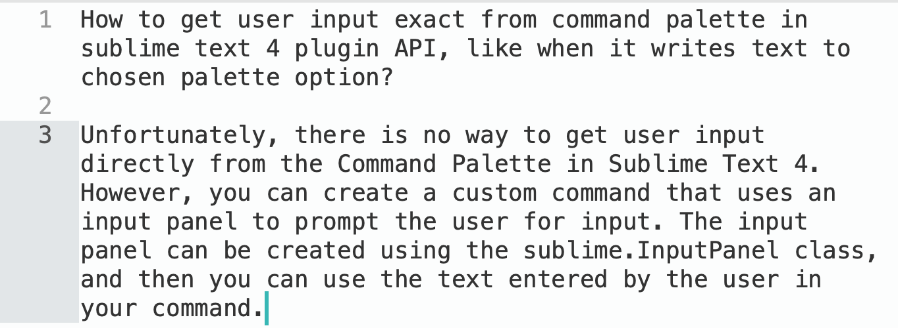
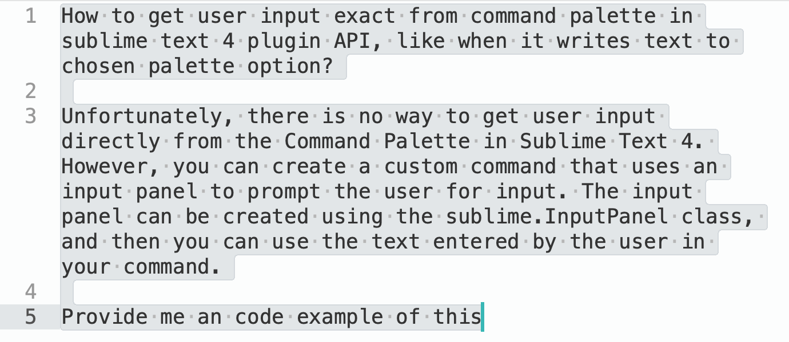
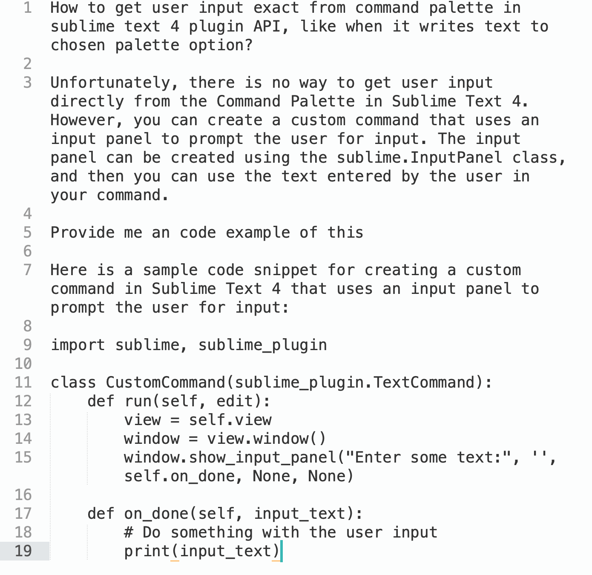

# OpenAI Sublime Text Plugin
## Abstract

OpenAI Completion is a Sublime Text 4 plugin that uses the OpenAI natural language processing (NLP) model to provide suggestions for editing code within the Sublime Text editor.

## Features
- Append suggested text to selected code
- Insert suggested text instead of placeholder in selected code
- Edit selected code according to a given command

### Demo
<details><summary>Click to see screens</summary>


---


---


---

</details>

## Requirements

- Sublime Text 4
- [OpenAI](https://beta.openai.com/account) API key (paid service)
- Internet connection

## Usage
1. Open the Sublime Text 4 editor and select some code.
2. Open the command palette and run the `OpenAI Append`, `OpenAI Insert`, or `OpenAI Edit` command.
3. **The plugin will send the selected code to the OpenAI servers**, using your API key, to generate a suggestion for editing the code.
4. The suggestion will be modify the selected code in the editor, according to the command you ran (append, insert, or edit).

## Settings
The OpenAI Completion plugin has a settings file where you can set your OpenAI API key. This is required for the plugin to work. To set your API key, open the settings within `Preferences` -> `Package Settings` -> `OpenAI` -> `Settings` and paste in User settings your API key in token property, like follow:
```JSON
{
    "token": "sk-your-token",
}
```

## Note
Please note that OpenAI is a paid service, and you will need to have an API key and sufficient credit to use the plugin.

Additionally, **all selected code will be sent to the OpenAI servers for processing, so make sure you have the necessary permissions to do so**.

## Disclamer
This one was at 80% written by that thing itself including this readme. I was here mostly for debugging purposes, rather then designing and researching. This is pure magic, i swear.
